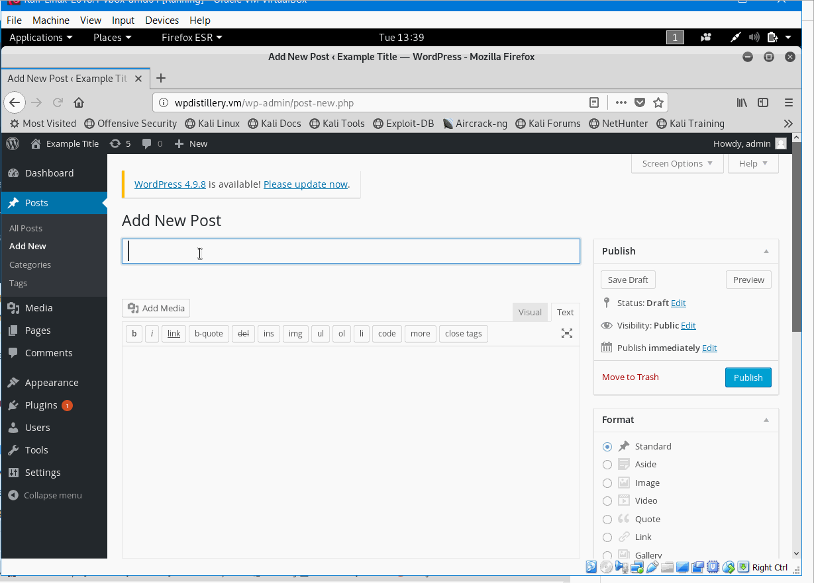
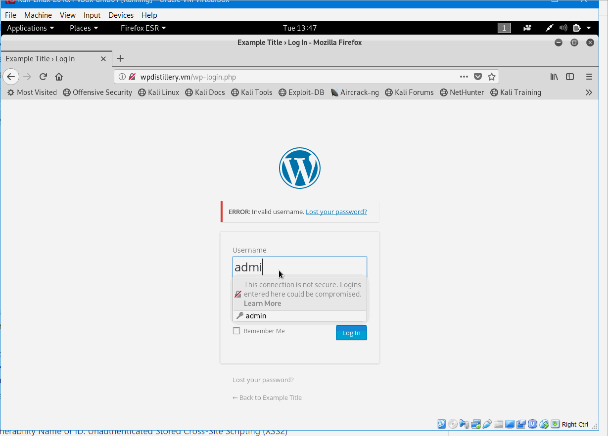
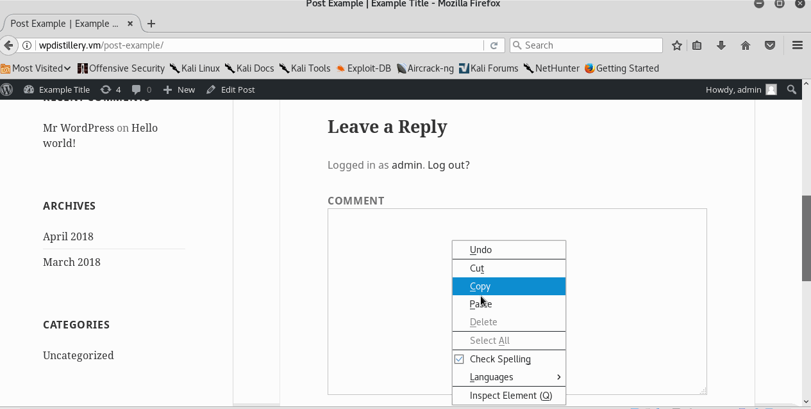
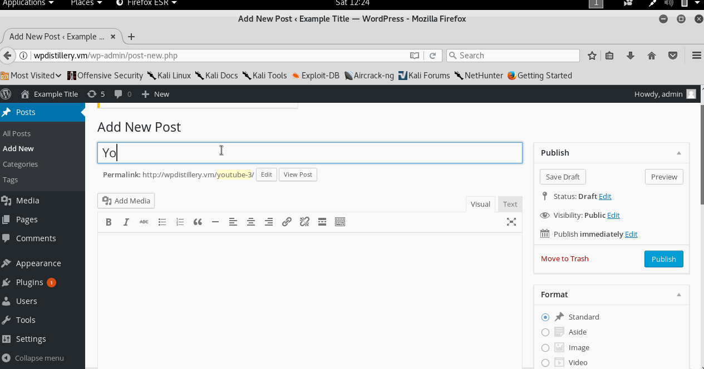

# Project 7 - WordPress Pentesting

Time spent: **13** hours spent in total

> Objective: Find, analyze, recreate, and document **five vulnerabilities** affecting an old version of WordPress

## Pentesting Report

1. (Required) Vulnerability Name or ID: Authenticated Stored Cross-Site Scripting(XSS1)
  - [x] Summary: 
    - Vulnerability types: XSS
    - Tested in version: 4.2
    - Fixed in version: 4.2.3
  - [x] GIF Walkthrough: 
    - 
  - [x] Steps to recreate: 
    - Create a new post, and then enter this line ```<a onmouseover= "alert('I got you!')" >click here</a>``` in the content link. lastly click link to show message in the preview of post.
  - [x] Affected source code:
    - [Link 1](https://core.trac.wordpress.org/browser/branches/4.2/src/wp-includes/class-wp-editor.php?rev=33361)

2. (Required) Vulnerability Name or ID: User Enumeration
  - [x] Summary: 
    - Vulnerability types: User Enumeration
    - Tested in version: 4.2
    - Fixed in version: N/A
  - [x] GIF Walkthrough: 
    - 
  - [x] Steps to recreate: 
    - on the WordPress login page, when you enter admin as username and empty password field, then it shows the error that the password field is empty. 
    When you enter admin as username and randomly input password,and then it shows the error that the password you entered for the username admin is incorrect.  When you randomly input both username and password, then it shows the error that invalid username.
  - [x] Affected source code:
    - [Link 2](https://www.wpwhitesecurity.com/wordpress-security/wordpress-username-disclosure-vulnerability/)

3. (Required) Vulnerability Name or ID: Unauthenticated Stored Cross-Site Scripting (XSS2)
  - [x] Summary: 
    - Vulnerability types: XSS
    - Tested in version: 4.2
    - Fixed in version: 4.2.4
  - [x] GIF Walkthrough: 
    - 
  - [x] Steps to recreate: 
    - View a new post, and put ths code ```<abbr title='Web......cedric' onmouseover='alert(1)' style='position:fixed;top:0;left:0;width:100%;height:100%'>``` on the comment under this post. Then it shows 1 when you view the comment of this post in future. 
  - [x] Affected source code:
    - [Link 3](https://cedricvb.be/post/wordpress-stored-xss-vulnerability-4-1-2/)

4. (Optional) Vulnerability Name or ID: Oversized File Upload Error Cross-Site Scripting (XSS3)
  - [x] Summary: 
    - Vulnerability types: XSS
    - Tested in version: 4.2
    - Fixed in version: 4.2.13
  - [x] GIF Walkthrough: 
    - 
  - [x] Steps to recreate: 
    - Creat new video format post and input this code ```[embed src='https://youtube.com/embed/123\x3csvg onload=alert(123)\x3e'][/embed]``` 
      and then it will shows 123 when you view it each time.
  - [x] Affected source code:
    - [Link 4](https://github.com/WordPress/WordPress/commit/419c8d97ce8df7d5004ee0b566bc5e095f0a6ca8)


## Assets

List any additional assets, such as scripts or files

## Resources

- [WordPress Source Browser](https://core.trac.wordpress.org/browser/)
- [WordPress Developer Reference](https://developer.wordpress.org/reference/)

GIFs created with [LiceCap](http://www.cockos.com/licecap/).

## Notes

Describe any challenges encountered while doing the work

## License

    Copyright [2018] [Youwen Zeng]

    Licensed under the Apache License, Version 2.0 (the "License");
    you may not use this file except in compliance with the License.
    You may obtain a copy of the License at

        http://www.apache.org/licenses/LICENSE-2.0

    Unless required by applicable law or agreed to in writing, software
    distributed under the License is distributed on an "AS IS" BASIS,
    WITHOUT WARRANTIES OR CONDITIONS OF ANY KIND, either express or implied.
    See the License for the specific language governing permissions and
    limitations under the License.
